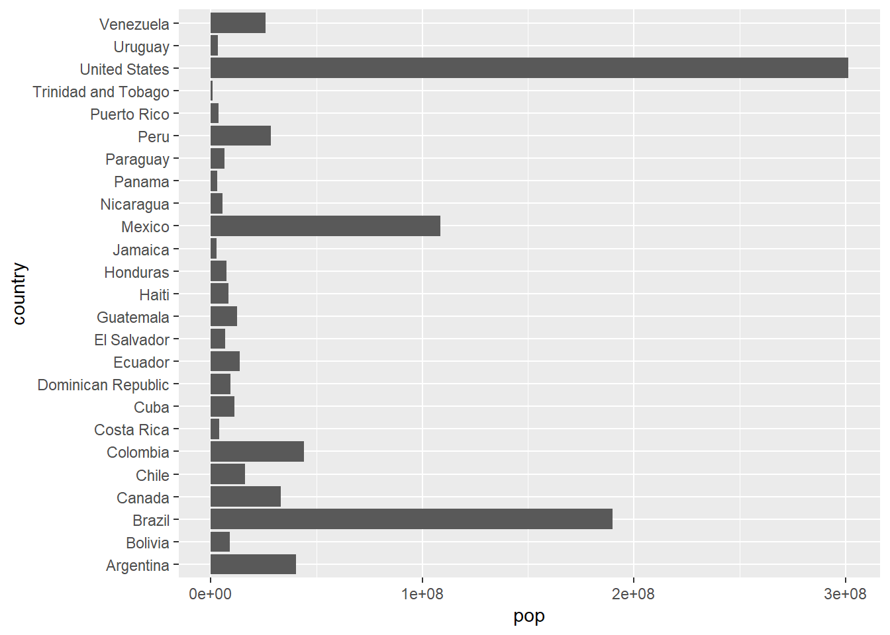
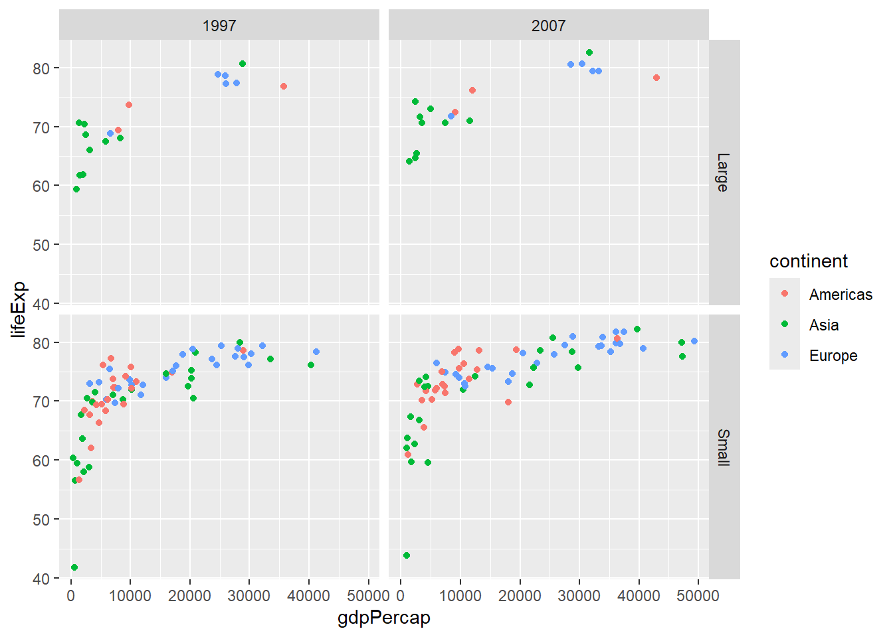

# Data Visualization in R
The tidyverse is a bit scary perhaps, when only getting into it. It is very quick to learn though, I promise. The best thing for me personally about the tidyverse, and perhaps about all of R, are the figures one can make with **ggplot2**. It really does not take that much to produce beautiful figures, that are basically publication-ready. It is not that difficult and the figures are much more beautiful than one could ever make with Excel or Statica.

## ggplot2: The Grammar of Graphics

**ggplot2** is the tidyverse package for data visualization, based on Leland Wilkinson's "Grammar of Graphics." Unlike base R plotting, ggplot2 builds plots layer by layer using a consistent grammar that makes complex visualizations intuitive and customizable.

The grammar of graphics breaks down any plot into fundamental components:

- **Data**: The dataset you want to visualize
- **Aesthetics (aes)**: How variables map to visual properties (x, y, color, size, etc.)
- **Geometries (geom)**: The visual elements that represent data (points, lines, bars, etc.)
- **Statistics (stat)**: Statistical transformations of the data (counts, means, etc.)
- **Scales**: How aesthetic mappings translate to visual values
- **Coordinate systems**: How data maps to the plot area
- **Themes**: Overall visual appearance

### Basic ggplot2 Structure

Every ggplot follows this basic template:

```
# Basic template
ggplot(data = <DATA>) + 
  <GEOM_FUNCTION>(mapping = aes(<MAPPINGS>)) +
  <OTHER_LAYERS>
```

Let's start with the gapminder dataset to explore these concepts:


```r
library(ggplot2)
library(gapminder)
library(tidyverse)
```

```
## ── Attaching core tidyverse packages ──────────────────────── tidyverse 2.0.0 ──
## ✔ dplyr     1.1.4     ✔ readr     2.1.5
## ✔ forcats   1.0.0     ✔ stringr   1.5.1
## ✔ lubridate 1.9.3     ✔ tibble    3.2.1
## ✔ purrr     1.0.2     ✔ tidyr     1.3.1
## ── Conflicts ────────────────────────────────────────── tidyverse_conflicts() ──
## ✖ dplyr::filter() masks stats::filter()
## ✖ dplyr::lag()    masks stats::lag()
## ℹ Use the conflicted package (<http://conflicted.r-lib.org/>) to force all conflicts to become errors
```

```r
# Preview the data
head(gapminder)
```

```
## # A tibble: 6 × 6
##   country     continent  year lifeExp      pop gdpPercap
##   <fct>       <fct>     <int>   <dbl>    <int>     <dbl>
## 1 Afghanistan Asia       1952    28.8  8425333      779.
## 2 Afghanistan Asia       1957    30.3  9240934      821.
## 3 Afghanistan Asia       1962    32.0 10267083      853.
## 4 Afghanistan Asia       1967    34.0 11537966      836.
## 5 Afghanistan Asia       1972    36.1 13079460      740.
## 6 Afghanistan Asia       1977    38.4 14880372      786.
```

## Basic Plot Types

### Scatter Plots with `geom_point()`


```r
# Basic scatter plot
ggplot(data = gapminder, mapping = aes(x = gdpPercap, y = lifeExp)) +
  geom_point()
```


```r
# Add color mapping
ggplot(data = gapminder, aes(x = gdpPercap, y = lifeExp, color = continent)) +
  geom_point()
```


```r
# Add size mapping
ggplot(data = gapminder, aes(x = gdpPercap, y = lifeExp, 
                           color = continent, size = pop)) +
  geom_point(alpha = 0.7)  # alpha controls transparency
```


### Line Plots with `geom_line()`


```r
# Line plot showing trends over time
gapminder %>%
  filter(country %in% c("United States", "China", "India", "Germany")) %>%
  ggplot(aes(x = year, y = lifeExp, color = country)) +
  geom_line(size = 1.2)
```

```
## Warning: Using `size` aesthetic for lines was deprecated in ggplot2 3.4.0.
## ℹ Please use `linewidth` instead.
## This warning is displayed once every 8 hours.
## Call `lifecycle::last_lifecycle_warnings()` to see where this warning was
## generated.
```


```r
# Multiple lines with points
gapminder %>%
  filter(continent == "Oceania") %>%
  ggplot(aes(x = year, y = gdpPercap, color = country)) +
  geom_line() +
  geom_point()
```


### Bar Plots with `geom_col()` and `geom_bar()`


```r
# geom_col: heights of bars represent values in data
gapminder %>%
  filter(year == 2007, continent == "Americas") %>%
  ggplot(aes(x = country, y = pop)) +
  geom_col() +
  coord_flip()  # Flip coordinates for better readability
```



```r
# geom_bar: counts observations
gapminder %>%
  filter(year == 2007) %>%
  ggplot(aes(x = continent)) +
  geom_bar()
```


```r
# Stacked bar chart
gapminder %>%
  filter(year %in% c(1997, 2007)) %>%
  mutate(year = as.factor(year)) %>%
  ggplot(aes(x = continent, fill = year)) +
  geom_bar(position = "stack")
```


### Histograms with `geom_histogram()`


```r
# Basic histogram
gapminder %>%
  filter(year == 2007) %>%
  ggplot(aes(x = lifeExp)) +
  geom_histogram(bins = 20, fill = "skyblue", color = "black")
```


```r
# Histogram with different binwidths
gapminder %>%
  filter(year == 2007) %>%
  ggplot(aes(x = gdpPercap)) +
  geom_histogram(binwidth = 5000, fill = "lightgreen", alpha = 0.7)
```


### Box Plots with `geom_boxplot()`


```r
# Basic box plot
gapminder %>%
  filter(year == 2007) %>%
  ggplot(aes(x = continent, y = lifeExp)) +
  geom_boxplot()
```


```r
# Box plot with jittered points
gapminder %>%
  filter(year == 2007) %>%
  ggplot(aes(x = continent, y = lifeExp, fill = continent)) +
  geom_boxplot(alpha = 0.7) +
  geom_jitter(width = 0.2, alpha = 0.5)
```


## Aesthetic Mappings

### Understanding `aes()`

Aesthetics map variables to visual properties. You can set them globally (in `ggplot()`) or locally (in individual `geom` functions):


```r
# Global aesthetic mappings
gapminder %>%
  filter(year == 2007) %>%
  ggplot(aes(x = gdpPercap, y = lifeExp, color = continent, size = pop)) +
  geom_point(alpha = 0.7)
```


```r
# Local aesthetic mappings
gapminder %>%
  filter(year == 2007) %>%
  ggplot(aes(x = gdpPercap, y = lifeExp)) +
  geom_point(aes(color = continent, size = pop), alpha = 0.7)
```


### Fixed vs. Mapped Aesthetics


```r
# WRONG: color inside aes() when you want a fixed color
# This creates a legend with one color
ggplot(gapminder, aes(x = gdpPercap, y = lifeExp, color = "blue")) +
  geom_point()
```


```r
# CORRECT: fixed color outside aes()
ggplot(gapminder, aes(x = gdpPercap, y = lifeExp)) +
  geom_point(color = "blue")
```


```r
# CORRECT: mapped color inside aes()
ggplot(gapminder, aes(x = gdpPercap, y = lifeExp, color = continent)) +
  geom_point()
```


## Faceting: Small Multiples

### `facet_wrap()`


```r
# Facet by one variable
gapminder %>%
  filter(year %in% c(1977, 1987, 1997, 2007)) %>%
  ggplot(aes(x = gdpPercap, y = lifeExp, color = continent)) +
  geom_point() +
  facet_wrap(~ year)
```


```r
# Control facet layout
gapminder %>%
  ggplot(aes(x = year, y = lifeExp, group = country)) +
  geom_line(alpha = 0.3) +
  facet_wrap(~ continent, nrow = 2)
```


### `facet_grid()`


```r
# Facet by two variables
gapminder %>%
  filter(year %in% c(1997, 2007), 
         continent %in% c("Americas", "Europe", "Asia")) %>%
  mutate(pop_category = ifelse(pop > 50000000, "Large", "Small")) %>%
  ggplot(aes(x = gdpPercap, y = lifeExp, color = continent)) +
  geom_point() +
  facet_grid(pop_category ~ year)
```



## Statistical Transformations

### Smooth Lines with `geom_smooth()`


```r
# Add trend line
gapminder %>%
  filter(year == 2007) %>%
  ggplot(aes(x = gdpPercap, y = lifeExp)) +
  geom_point(aes(color = continent), alpha = 0.7) +
  geom_smooth(method = "lm", se = FALSE, color = "black")
```

```
## `geom_smooth()` using formula = 'y ~ x'
```


```r
# Separate trend lines by group
gapminder %>%
  filter(year == 2007) %>%
  ggplot(aes(x = gdpPercap, y = lifeExp, color = continent)) +
  geom_point(alpha = 0.7) +
  geom_smooth(method = "lm", se = FALSE)
```

```
## `geom_smooth()` using formula = 'y ~ x'
```


### Statistical Summaries


```r
# stat_summary for custom statistics
gapminder %>%
  filter(year == 2007) %>%
  ggplot(aes(x = continent, y = lifeExp)) +
  stat_summary(fun = mean, geom = "point", size = 3, color = "red") +
  stat_summary(fun.data = mean_se, geom = "errorbar", width = 0.2) +
  geom_jitter(alpha = 0.3, width = 0.2)
```


## Scales: Controlling Aesthetic Mappings

### Color Scales


```r
# Manual color scale
gapminder %>%
  filter(year == 2007) %>%
  ggplot(aes(x = gdpPercap, y = lifeExp, color = continent)) +
  geom_point(size = 2) +
  scale_color_manual(values = c("Africa" = "red", "Americas" = "blue", 
                               "Asia" = "green", "Europe" = "orange", 
                               "Oceania" = "purple"))
```


```r
# Brewer color palette
gapminder %>%
  filter(year == 2007) %>%
  ggplot(aes(x = gdpPercap, y = lifeExp, color = continent)) +
  geom_point(size = 2) +
  scale_color_brewer(type = "qual", palette = "Set2")
```


```r
# Viridis color palette
gapminder %>%
  filter(year == 2007) %>%
  ggplot(aes(x = gdpPercap, y = lifeExp, color = pop)) +
  geom_point(size = 2) +
  scale_color_viridis_c()
```


### Axis Scales


```r
# Log scale for x-axis
gapminder %>%
  filter(year == 2007) %>%
  ggplot(aes(x = gdpPercap, y = lifeExp, color = continent)) +
  geom_point(size = 2) +
  scale_x_log10()
```


```r
# Custom breaks and labels
gapminder %>%
  filter(year == 2007) %>%
  ggplot(aes(x = gdpPercap, y = lifeExp, color = continent)) +
  geom_point(size = 2) +
  scale_x_continuous(breaks = seq(0, 50000, 10000),
                     labels = paste0("$", seq(0, 50, 10), "K"))
```


```r
# Limit axis ranges
gapminder %>%
  filter(year == 2007) %>%
  ggplot(aes(x = gdpPercap, y = lifeExp, color = continent)) +
  geom_point(size = 2) +
  xlim(0, 30000) +
  ylim(40, 85)
```

```
## Warning: Removed 21 rows containing missing values or values outside the scale range
## (`geom_point()`).
```


## Coordinates and Transformations


```r
# Flip coordinates
gapminder %>%
  filter(year == 2007, continent == "Europe") %>%
  ggplot(aes(x = reorder(country, lifeExp), y = lifeExp)) +
  geom_col() +
  coord_flip()
```


```r
# Polar coordinates (for pie charts)
gapminder %>%
  filter(year == 2007) %>%
  count(continent) %>%
  ggplot(aes(x = "", y = n, fill = continent)) +
  geom_col() +
  coord_polar(theta = "y")
```


```r
# Fixed aspect ratio
gapminder %>%
  filter(year == 2007) %>%
  ggplot(aes(x = gdpPercap, y = lifeExp)) +
  geom_point() +
  coord_fixed(ratio = 300)  # 300 GDP per capita = 1 year life expectancy
```


## Labels and Themes

### Adding Labels


```r
# Basic labels
gapminder %>%
  filter(year == 2007) %>%
  ggplot(aes(x = gdpPercap, y = lifeExp, color = continent)) +
  geom_point(size = 2) +
  labs(
    title = "Life Expectancy vs GDP Per Capita (2007)",
    subtitle = "Each point represents a country",
    x = "GDP per capita (USD)",
    y = "Life expectancy (years)",
    color = "Continent",
    caption = "Data source: Gapminder"
  )
```


### Theme Customization


```r
# Built-in themes
p <- gapminder %>%
  filter(year == 2007) %>%
  ggplot(aes(x = gdpPercap, y = lifeExp, color = continent)) +
  geom_point(size = 2)

# Different theme options
p + theme_minimal()
```


```r
p + theme_classic()
```


```r
p + theme_dark()
```


```r
p + theme_void()
```


```r
# Custom theme modifications
p +
  theme_minimal() +
  theme(
    plot.title = element_text(size = 16, face = "bold"),
    axis.text = element_text(size = 12),
    legend.position = "bottom",
    panel.grid.minor = element_blank()
  )
```


## Heatmaps
Coming soon ... 

## Combining Multiple Geoms


```r
# Combining points and lines
gapminder %>%
  filter(continent == "Americas") %>%
  group_by(year) %>%
  summarise(avg_life_exp = mean(lifeExp), .groups = 'drop') %>%
  ggplot(aes(x = year, y = avg_life_exp)) +
  geom_line(size = 1.2, color = "blue") +
  geom_point(size = 3, color = "red") +
  labs(title = "Average Life Expectancy in Americas Over Time",
       y = "Average Life Expectancy")
```


```r
# Error bars with points
gapminder %>%
  filter(year == 2007) %>%
  group_by(continent) %>%
  summarise(
    mean_life = mean(lifeExp),
    se_life = sd(lifeExp) / sqrt(n()),
    .groups = 'drop'
  ) %>%
  ggplot(aes(x = continent, y = mean_life)) +
  geom_col(fill = "lightblue", alpha = 0.7) +
  geom_errorbar(aes(ymin = mean_life - se_life, 
                   ymax = mean_life + se_life),
                width = 0.2)
```


## Text and Annotations


```r
# Add text labels to points
gapminder %>%
  filter(year == 2007, continent == "Europe") %>%
  ggplot(aes(x = gdpPercap, y = lifeExp)) +
  geom_point() +
  geom_text(aes(label = country), size = 3, hjust = -0.1)
```


```r
# Better: use geom_text_repel to avoid overlapping
library(ggrepel)
gapminder %>%
  filter(year == 2007, continent == "Europe") %>%
  ggplot(aes(x = gdpPercap, y = lifeExp)) +
  geom_point() +
  geom_text_repel(aes(label = country), size = 3)
```


## Practical Example: Complex Multi-layered Plot


```r
# Complex visualization combining multiple elements
complex_plot <- gapminder %>%
  filter(year %in% c(1977, 1987, 1997, 2007)) %>%
  ggplot(aes(x = gdpPercap, y = lifeExp)) +
  
  # Add points with continent color and population size
  geom_point(aes(color = continent, size = pop), alpha = 0.7) +
  
  # Add trend line
  geom_smooth(method = "lm", se = FALSE, color = "black", size = 0.5) +
  
  # Facet by year
  facet_wrap(~ year, nrow = 2) +
  
  # Use log scale for x-axis
  scale_x_log10(breaks = c(500, 2000, 8000, 32000),
                labels = c("$500", "$2,000", "$8,000", "$32,000")) +
  
  # Customize colors
  scale_color_brewer(type = "qual", palette = "Set2") +
  
  # Adjust size scale
  scale_size_continuous(range = c(1, 8), guide = "none") +
  
  # Add labels
  labs(
    title = "The Relationship Between Wealth and Health Over Time",
    subtitle = "GDP per capita vs Life Expectancy (1977-2007)",
    x = "GDP per capita (log scale)",
    y = "Life expectancy (years)",
    color = "Continent",
    caption = "Point size represents population size. Data: Gapminder"
  ) +
  
  # Customize theme
  theme_minimal() +
  theme(
    plot.title = element_text(size = 14, face = "bold"),
    plot.subtitle = element_text(size = 11),
    strip.text = element_text(size = 10, face = "bold"),
    legend.position = "bottom"
  )

complex_plot
```

```
## `geom_smooth()` using formula = 'y ~ x'
```


## ggplot2 Function Summary Table

| Function | Category | Description | Example |
|----------|----------|-------------|---------|
| `ggplot()` | Core | Initialize a plot with data and aesthetics | `ggplot(data, aes(x = var1, y = var2))` |
| `aes()` | Core | Define aesthetic mappings | `aes(x = gdp, y = life, color = continent)` |
| `geom_point()` | Geoms | Add points (scatter plot) | `geom_point(size = 2, alpha = 0.7)` |
| `geom_line()` | Geoms | Add lines | `geom_line(size = 1.2)` |
| `geom_col()` | Geoms | Add bars with heights from data | `geom_col(fill = "blue")` |
| `geom_bar()` | Geoms | Add bars that count observations | `geom_bar()` |
| `geom_histogram()` | Geoms | Add histogram | `geom_histogram(bins = 20)` |
| `geom_boxplot()` | Geoms | Add box plot | `geom_boxplot()` |
| `geom_density()` | Geoms | Add density curve | `geom_density(alpha = 0.5)` |
| `geom_violin()` | Geoms | Add violin plot | `geom_violin()` |
| `geom_tile()` | Geoms | Add tiles (heatmap) | `geom_tile()` |
| `geom_smooth()` | Geoms | Add smoothed trend line | `geom_smooth(method = "lm")` |
| `geom_text()` | Geoms | Add text labels | `geom_text(aes(label = country))` |
| `geom_jitter()` | Geoms | Add jittered points | `geom_jitter(width = 0.2)` |
| `facet_wrap()` | Facets | Create subplots in a wrapped layout | `facet_wrap(~ variable)` |
| `facet_grid()` | Facets | Create subplots in a grid | `facet_grid(var1 ~ var2)` |
| `scale_x_continuous()` | Scales | Customize continuous x-axis | `scale_x_continuous(breaks = c(1,2,3))` |
| `scale_x_log10()` | Scales | Use log10 scale for x-axis | `scale_x_log10()` |
| `scale_color_manual()` | Scales | Manually set colors | `scale_color_manual(values = c("red", "blue"))` |
| `scale_color_brewer()` | Scales | Use ColorBrewer palette | `scale_color_brewer(palette = "Set2")` |
| `scale_color_viridis_c()` | Scales | Use Viridis color scale (continuous) | `scale_color_viridis_c()` |
| `xlim()` / `ylim()` | Scales | Set axis limits | `xlim(0, 100)` |
| `coord_flip()` | Coordinates | Flip x and y coordinates | `coord_flip()` |
| `coord_polar()` | Coordinates | Use polar coordinates | `coord_polar(theta = "y")` |
| `coord_fixed()` | Coordinates | Fix aspect ratio | `coord_fixed(ratio = 1)` |
| `labs()` | Labels | Add/modify plot labels | `labs(title = "My Plot", x = "X axis")` |
| `ggtitle()` | Labels | Add plot title | `ggtitle("My Plot Title")` |
| `xlab()` / `ylab()` | Labels | Add axis labels | `xlab("X axis label")` |
| `theme()` | Themes | Customize plot appearance | `theme(legend.position = "bottom")` |
| `theme_minimal()` | Themes | Apply minimal theme | `theme_minimal()` |
| `theme_classic()` | Themes | Apply classic theme | `theme_classic()` |
| `theme_dark()` | Themes | Apply dark theme | `theme_dark()` |
| `annotate()` | Annotations | Add annotations to plot | `annotate("text", x = 1, y = 2, label = "Note")` |

## Tips and Tricks

**Colors**
A good colorscale can make an enormous difference. For discrete data I like to use the scales `Paired`, `Dark2` and for continuous data I like using the `inferno`, `magma` and `coolwarm` palettes. Make sure the scale you choose is intuitive and easy to interpret. When making figures ready for shared or published work, make sure that it is colorblind-friendly (the viridis color palettes are especially chosen for this). And when preparing for a presentation always make sure that your figure would still be readable if the resolution is low (for example because of an old projector). Be prepared! For more information on color scales, have a look at this [website](https://www.datanovia.com/en/blog/top-r-color-palettes-to-know-for-great-data-visualization/).

**Scales and Axes**
Always label your axes clearly and use units when relevant. If one variable spans many orders of magnitude, consider using a log scale. Also check that your axis limits don’t exaggerate or minimize effects (avoid "truncating" axes unless you have a good reason).

**Faceting**
When comparing groups or categories, faceting (facet_wrap or facet_grid) is often clearer than putting everything into one crowded plot. It makes patterns easier to see across groups.

**Annotations**
Don’t be afraid to annotate! Adding text labels, arrows, or lines (like geom_text, geom_label, geom_vline) can help guide the reader to the most important takeaways.

**Themes**
Use themes (theme_minimal(), theme_classic(), etc.) to quickly adjust the overall look. If you’re preparing figures for teaching or publication, setting a consistent theme across all your figures improves readability. The cool thing is that some very interesting journals and platforms have their own ggplot-themes to be used in R. For this, have a look at the package **ggthemes** which includes `theme_economist()` and `theme_wj()` (Wall Street Journal), among others.

**Clarity in Legends**
Place legends where they don’t overlap with the data, and make sure the labels are descriptive. Sometimes it’s even better to replace the legend entirely with direct labeling inside the plot.

## Conclusion

ggplot2's grammar of graphics provides a powerful and consistent framework for creating visualizations. The key principles to remember are:

1. **Build plots layer by layer** - start with data and aesthetics, then add geoms, scales, and themes
2. **Map variables to aesthetics** - use `aes()` to connect your data to visual properties  
3. **Choose appropriate geoms** - different geoms for different types of data and relationships
4. **Use faceting** - create small multiples to show patterns across groups
5. **Customize with scales and themes** - fine-tune appearance and mapping of aesthetic properties

By mastering these concepts and functions, you can create publication-ready visualizations that effectively communicate insights from your data.


## My favorite figures I ever made
While in my internship, I was able to work with a huge dataset on detected enteroviruses in clinical settings all over Europe. I collected, harmonized, analyzed and visualized all that data which even got published! The first figure displays the number of detections per month throughout the study periods (with summer months in red) (fig A) and the relative intensity of specific virus types. A light color means that in that specific month, that specific enterovirus type was very common (fig B). The second figure shows a classic epicurve per specific virus type (in red) with the total number of detected enteroviruses per month in grey [@DeSchrijver2025].


