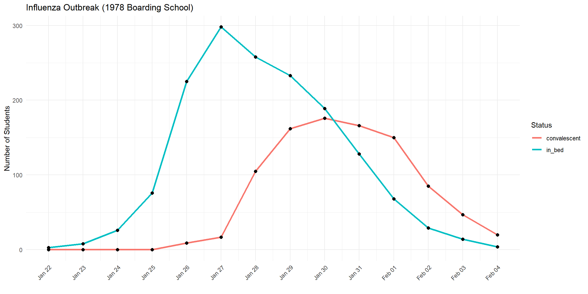
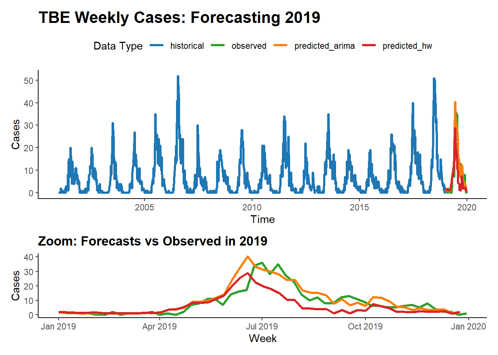

# Modelling

## Compartmental models  


### SIR model in theory

Compartmental models divide a population into distinct groups, or *compartments*, each governed by specific rules that describe how individuals move between compartments over time. In epidemiology, one of the most common models is the **SIR model**, which divides the population into three compartments:

- **Susceptible (S)**: individuals who can contract the disease  
- **Infectious (I)**: individuals who are currently infected and can transmit the disease  
- **Recovered (R)**: individuals who have recovered and are no longer infectious  

Individuals move from **S** to **I** (when infected), and from **I** to **R** (when they recover). This progression can be described using either discrete-time or continuous-time equations.

#### Discrete-Time Formulation

The discrete-time version of the SIR model is expressed as:

$$
\begin{aligned}
S_{t+1} &= S_t - \beta S_t I_t \\
I_{t+1} &= I_t + \beta S_t I_t - \gamma I_t \\
R_{t+1} &= R_t + \gamma I_t
\end{aligned}
$$

Here, $S_{t+1}$ is the number of susceptible individuals at the next time step, determined by subtracting those who become infected. $I_{t+1}$ increases with new infections and decreases as people recover. $R_{t+1}$ increases with recoveries.

#### Continuous-Time Formulation (ODEs)

For more refined, continuous-time modeling, we use ordinary differential equations:

$$
\begin{aligned}
\frac{dS}{dt} &= -\beta S I \\
\frac{dI}{dt} &= \beta S I - \gamma I \\
\frac{dR}{dt} &= \gamma I
\end{aligned}
$$

These represent the rate of change of each compartment over time.

Where:
- $\beta$ is the **transmission rate**
- $\gamma$ is the **recovery rate**
- $N = S + I + R$ is the **total population**

### SIR model in R

Despite its simplicity, the SIR model can be surprisingly effective. During the COVID-19 pandemic, many government advisors based their projections on variations of this basic framework.

As an example, consider an influenza outbreak that occurred in 1978 at a boarding school in England. The on-site physician documented how many students were sick (in bed) and how many were recovering (convalescent) each day. This dataset is included in the `outbreaks` R package, allowing us to study it directly.


```r
library(outbreaks)
data("influenza_england_1978_school")
outbreak_data <- influenza_england_1978_school
head(outbreak_data)
```

```
##         date in_bed convalescent
## 1 1978-01-22      3            0
## 2 1978-01-23      8            0
## 3 1978-01-24     26            0
## 4 1978-01-25     76            0
## 5 1978-01-26    225            9
## 6 1978-01-27    298           17
```


```r
outbreak_data_long <- pivot_longer(outbreak_data, 
                                   cols = c(in_bed, convalescent),
                                   names_to = "group", values_to = "count")

ggplot(outbreak_data_long, aes(x = date, y = count, color = group)) +
  geom_line(linewidth = 1.2) +
  geom_point(color = "black", size = 2) +
  scale_x_date(breaks = outbreak_data_long$date, date_labels = "%b %d") +
  labs(title = "Influenza Outbreak (1978 Boarding School)",
       x = "", y = "Number of Students", color = "Status") +
  theme_minimal() +
  theme(axis.text.x = element_text(angle = 45, hjust = 1))
```



Now let’s implement the SIR model in R:


```r
sir_model <- function(number_of_days, BETA, GAMMA, dt = 1) {
  N <- 763
  I0 <- 1
  S0 <- N - I0
  R0 <- 0

  times <- seq(0, number_of_days, by = dt)
  n_steps <- length(times)

  sirdata <- data.frame(
    t = times,
    S = numeric(n_steps),
    I = numeric(n_steps),
    R = numeric(n_steps)
  )

  sirdata[1, ] <- c(0, S0, I0, R0)

  for (tt in 2:n_steps) {
    S_prev <- sirdata$S[tt - 1]
    I_prev <- sirdata$I[tt - 1]
    R_prev <- sirdata$R[tt - 1]

    new_infections <- BETA * S_prev * I_prev * dt
    new_recoveries <- GAMMA * I_prev * dt

    new_infections <- min(new_infections, S_prev)
    new_recoveries <- min(new_recoveries, I_prev)

    S_new <- S_prev - new_infections
    I_new <- I_prev + new_infections - new_recoveries
    R_new <- R_prev + new_recoveries

    sirdata[tt, ] <- c(times[tt], S_new, I_new, R_new)
  }

  return(sirdata)
}
```


```r
output = sir_model(14, 0.0026, 0.565, 0.1)

sirdata_long = pivot_longer(output, cols = c("S", "I", "R"),
                            names_to = "compartment", values_to = "count")

ggplot(sirdata_long, aes(x = t, y = count, color = compartment)) +
  geom_line(linewidth = 1.2) +
  labs(title = "Influenza Outbreak (1978 Boarding School)",
       x = "", y = "Number of Students", color = "Status") +
  theme_minimal()
```


Let’s now compare the observed `in_bed` data with the simulated number of infectious individuals:


```r
sir_output <- sir_model(14, 0.0026, 0.565, dt = 0.1)

sir_daily <- sir_output %>%
  group_by(day = floor(t)) %>%
  summarize(I_simulated = mean(I))

observed_data <- outbreak_data %>%
  mutate(day = as.numeric(date - min(date))) %>%
  select(day, in_bed)

plot_data <- left_join(observed_data, sir_daily, by = "day") %>%
  pivot_longer(cols = c(in_bed, I_simulated),
               names_to = "type", values_to = "count")

ggplot(plot_data, aes(x = day, y = count, color = type)) +
  geom_line(linewidth = 1.2) +
  geom_point(size = 2, alpha = 0.8) +
  scale_x_continuous(breaks = 0:max(plot_data$day)) +
  labs(title = "Observed vs Simulated Infections",
       x = "Days Since Outbreak Start",
       y = "Number of Students",
       color = "Data Type") +
  theme_minimal() +
  theme(axis.text.x = element_text(angle = 0))
```


These compartmental models can be done using population-based equations, like here. One funadmental issue with those though, is that it is very hard to model heterogeneity in the population. In reality, we have clusters of people that are not vaccinated for example. Using the equations above, and adding a V compartment, the model would make the assumption that the vaccinated and unvaccinated are spread evently. That's why sometimes these models are implemented using **agent based models**, where individuals are modelled. The mathematics becomes a bit more complicated, but these models allow us to do much more. Below you will find two examples of such models.


For the following one, I modelled people moving around two dedicated centers, two cities if you will. There's very little, but some, movement between the cities. The infection start in city 1 and later also spreads to city 2.


## Time series - Forecasting  


Forecasting plays a crucial role in infectious disease epidemiology by enabling short-term projections of case counts. These projections help guide timely public health decisions, especially when diseases exhibit seasonal or trend-driven behavior. In this section, we compare two popular time series approaches:

Holt-Winters exponential smoothing, which models level, trend, and seasonality using exponentially weighted averages.

ARIMA (AutoRegressive Integrated Moving Average), a flexible class of models that can account for autoregressive lags, differencing (trends), and moving average components, including seasonal extensions (SARIMA).

Unlike mechanistic models (e.g., SIR), these statistical methods do not rely on assumptions about transmission mechanisms. Instead, they learn from the patterns and structure of historical data to forecast future values.

We apply both models to weekly national tick-borne encephalitis (TBE) cases and generate forecasts for the year following a specified historical cutoff.


```r
library(dplyr)
library(ggplot2)
library(forecast)
```

```
## Registered S3 method overwritten by 'quantmod':
##   method            from
##   as.zoo.data.frame zoo
```

```r
library(lubridate)
library(patchwork)

# --- Load and preprocess data ---
tbe_local <- read.csv("data/tick_borne_encephalitis.csv")

tbe_national <- tbe_local %>%
  mutate(timestamp = as.Date(timestamp)) %>%
  group_by(timestamp) %>%
  summarise(cases = sum(cases), .groups = "drop")

# --- Forecasting setup ---
year <- 2018  # Change to define cutoff year

tbe_national_context <- tbe_national %>%
  filter(year(timestamp) <= year)

tbe_national_future <- tbe_national %>%
  filter(year(timestamp) == year + 1) %>%
  arrange(timestamp)

# ---- Create time series object ----
context_ts <- ts(tbe_national_context$cases, frequency = 52)

# ---- Holt-Winters model ----
hw_model <- HoltWinters(context_ts)
forecast_hw <- forecast(hw_model, h = 52)

predicted_df_hw <- data.frame(
  timestamp = seq.Date(from = as.Date(paste0(year + 1, "-01-01")), by = "week", length.out = 52),
  cases = as.numeric(forecast_hw$mean),
  type = "predicted_hw"
)

# ---- ARIMA model ----
arima_model <- auto.arima(context_ts, seasonal = TRUE)
forecast_arima <- forecast(arima_model, h = 52)

predicted_df_arima <- data.frame(
  timestamp = seq.Date(from = as.Date(paste0(year + 1, "-01-01")), by = "week", length.out = 52),
  cases = as.numeric(forecast_arima$mean),
  type = "predicted_arima"
)

# ---- Combine all data for plotting ----
context_labeled <- tbe_national_context %>% mutate(type = "historical")
future_labeled  <- tbe_national_future %>% mutate(type = "observed")

combined_data <- bind_rows(context_labeled, future_labeled, predicted_df_hw, predicted_df_arima)

# ---- Plot full timeline ----
main_plot <- ggplot(combined_data, aes(x = timestamp, y = cases, color = type)) +
  geom_line(linewidth = 1.2) +
  scale_color_manual(values = c(
    "historical"      = "#1f77b4",
    "observed"        = "#2ca02c",
    "predicted_hw"    = "#d62728",
    "predicted_arima" = "#ff7f0e"
  )) +
  theme_classic() +
  labs(
    title = paste("TBE Weekly Cases: Forecasting", year + 1),
    x = "Time",
    y = "Cases",
    color = "Data Type"
  ) +
  theme(
    legend.position = "top",
    plot.title = element_text(face = "bold", size = 16)
  )

# ---- Plot zoomed forecast year ----
zoom_plot <- combined_data %>%
  filter(year(timestamp) == year + 1) %>%
  ggplot(aes(x = timestamp, y = cases, color = type)) +
  geom_line(linewidth = 1.2) +
  scale_color_manual(values = c(
    "historical"      = "#1f77b4",
    "observed"        = "#2ca02c",
    "predicted_hw"    = "#d62728",
    "predicted_arima" = "#ff7f0e"
  )) +
  theme_classic() +
  labs(
    title = paste("Zoom: Forecasts vs Observed in", year + 1),
    x = "Week",
    y = "Cases"
  ) +
  theme(
    legend.position = "none",
    plot.title = element_text(face = "bold")
  )

# ---- Combine and show ----
main_plot / zoom_plot + plot_layout(heights = c(2, 1))
```


This analysis demonstrates how different statistical forecasting methods—Holt-Winters vs ARIMA—perform on the same epidemiological time series. While Holt-Winters is intuitive and captures seasonality well, ARIMA can offer greater flexibility in modeling autocorrelated structures. Comparing their predictions side-by-side allows us to evaluate model fit and choose an approach best suited for early warning or planning systems.

## Using and applying models
