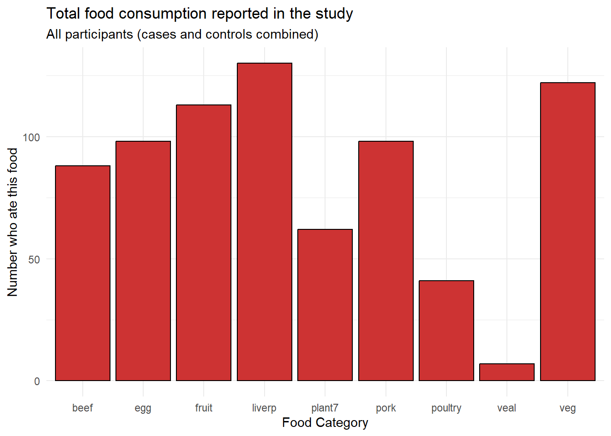
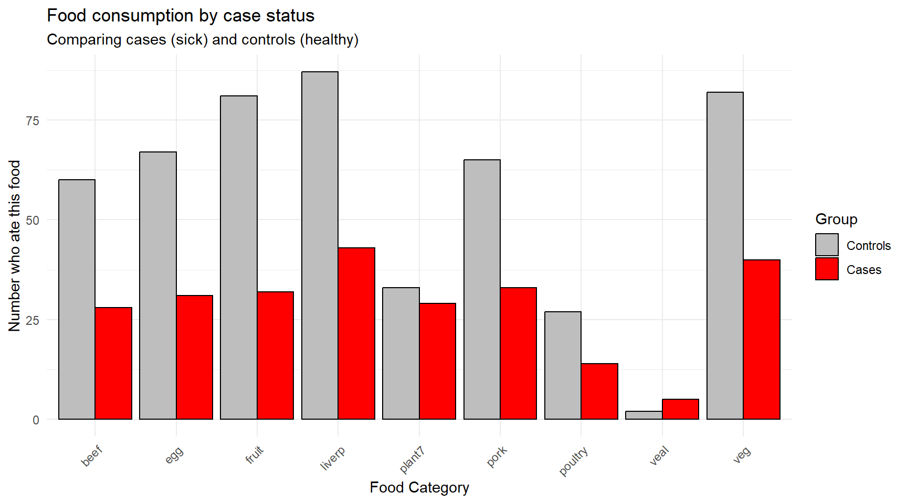
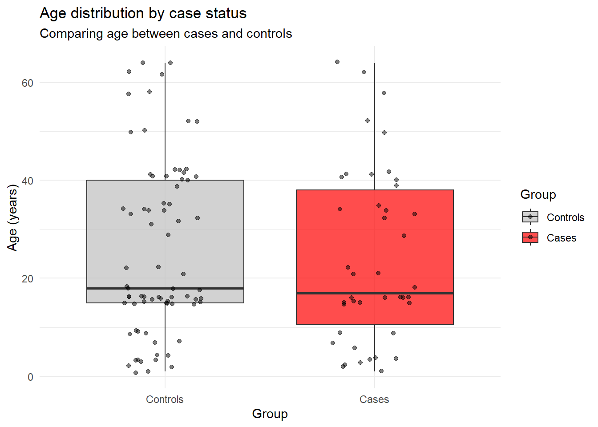
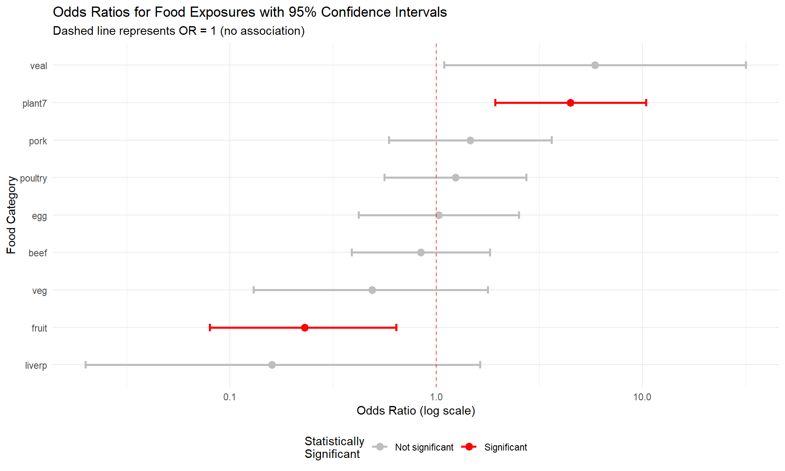

# Statistics

Broadly speaking, there's two fields of statistics, namely **descriptive statistics** and **inferential statistics**. Descriptive statistics summarize and organize data to make it understandable, using measures like means, medians, proportions, or visualizations such as histograms and bar charts. In contrast, inferential statistics go a step further by using data from a sample to make conclusions or predictions about a larger population. This involves estimating parameters, testing hypotheses, and calculating measures.

## Descriptive statistics and outbreak investigation

### Introduction

Outbreak investigations are critical components of public health practice. When people become sick from a common source, epidemiologists work quickly to identify the cause and prevent further illness. In this chapter, we'll analyze data from a **Salmonella Typhimurium** outbreak to demonstrate how statistical analysis can help identify the source of foodborne illness.

We'll be working with the `S.typh` dataset from the Epi package, which contains data from a real outbreak investigation conducted as a **matched case-control study**.

### Loading and Exploring the Data


```r
library(tidyverse)
```

```
## ── Attaching core tidyverse packages ──────────────────────── tidyverse 2.0.0 ──
## ✔ dplyr     1.1.4     ✔ readr     2.1.5
## ✔ forcats   1.0.0     ✔ stringr   1.5.1
## ✔ ggplot2   3.5.1     ✔ tibble    3.2.1
## ✔ lubridate 1.9.3     ✔ tidyr     1.3.1
## ✔ purrr     1.0.2     
## ── Conflicts ────────────────────────────────────────── tidyverse_conflicts() ──
## ✖ dplyr::filter() masks stats::filter()
## ✖ dplyr::lag()    masks stats::lag()
## ℹ Use the conflicted package (<http://conflicted.r-lib.org/>) to force all conflicts to become errors
```

```r
library(Epi)

# Load the dataset
data(S.typh)
typhoid_data <- S.typh

# Inspect the structure of our data
head(typhoid_data)
```

```
##   id set case age sex abroad beef pork veal poultry liverp veg fruit egg plant7
## 1  1   1    1  52   1      0    1    1    1       1      1   0     1   1      1
## 2  2   1    0  52   1      0    1    0    0       0      1   1     1   0      0
## 3  3   1    0  52   1      0    1    1    0       1      1   1     1   1      0
## 4  4   2    1  41   1      0    1   NA   NA      NA      1   1    NA  NA     NA
## 5  5   2    0  41   1      0    1    1    0       0      1   1     0   1      1
## 6  6   2    0  41   1      0    1    1    0       0      1   1     1   1      1
```

**Tip:** You can learn more about any dataset in R by typing `?S.typh` in your console. This will show you detailed documentation about the variables and study design.

#### Understanding the Variables

Our dataset contains the following variables:

- **id**: Person identification number
- **set**: Matched set indicator (used in the study design)
- **case**: Case-control status (1 = case/sick person, 0 = control/healthy person)
- **age**: Age of individual
- **sex**: Sex of individual (1 = male, 2 = female)
- **abroad**: Recent travel abroad in the last two weeks (1 = yes, 0 = no)

Additionally, we have 9 food exposure variables indicating whether each person consumed specific foods: `beef`, `pork`, `veal`, `poultry`, `liverp` (liver pâté), `veg` (vegetables), `fruit`, `egg`, `plant7`.

### Data Preparation: Creating a Tidy Dataset

Currently, our food exposure data is in "wide" format with separate columns for each food type. For analysis and visualization, we need to convert this to "long" format where each row represents one person-food combination. As you learned in Chapter 5, we can use the `pivot_longer()` function for this transformation.


```r
# Define our food categories
food_categories <- c('beef', 'pork', 'veal', 'poultry', 'liverp', 
                     'veg', 'fruit', 'egg', 'plant7')

# Convert to long format
typhoid_data_long <- typhoid_data %>%
  pivot_longer(cols = all_of(food_categories), 
               names_to = 'food', 
               values_to = 'eaten') %>%
  mutate(eaten = eaten,
         food = as.factor(food),
         case = as.factor(case))
```

### Initial Visual Exploration

Now that we have a long dataframe, we can create visualizations to explore patterns in food consumption among cases. Let's start by examining the total number of cases that reported eating each food category.


```r
# Calculate total consumption per food category among all participants
typhoid_cases_per_food <- typhoid_data_long %>%
  group_by(food) %>%
  summarise(eaten = sum(eaten, na.rm = TRUE))

# Create bar plot
ggplot(typhoid_cases_per_food) +
  geom_bar(aes(x = food, y = eaten),
           stat = "identity", 
           fill = 'brown3', 
           color = 'black') +
  theme_minimal() +
  labs(x = "Food Category", 
       y = "Number who ate this food", 
       title = "Total food consumption reported in the study",
       subtitle = "All participants (cases and controls combined)")
```



From this initial visualization, we can see that **beef**, **egg**, **fruit**, **liver pâté** (`liverp`), and **plant7** were consumed by many participants, while **poultry** and **veal** were less commonly consumed.

### Comparing Cases and Controls

However, the key question in outbreak investigation is not just which foods were commonly eaten, but which foods show a **difference** between cases (sick people) and controls (healthy people). Let's create a comparison visualization.


```r
# Calculate consumption by case status and food
typhoid_category_per_food <- typhoid_data_long %>% 
  group_by(case, food) %>%
  summarise(eaten = sum(eaten, na.rm = TRUE), .groups = 'drop')

# Create side-by-side bar plot
ggplot(typhoid_category_per_food) +
  geom_bar(aes(x = food, y = eaten, fill = factor(case)),
           stat = "identity", 
           color = 'black',
           position = position_dodge()) +
  scale_fill_manual(values = c("0" = "grey", "1" = "red"),
                    labels = c("0" = "Controls", "1" = "Cases")) +
  theme_minimal() +
  theme(axis.text.x = element_text(angle = 45, hjust = 1)) +
  labs(x = "Food Category", 
       y = "Number who ate this food", 
       fill = "Group",
       title = "Food consumption by case status",
       subtitle = "Comparing cases (sick) and controls (healthy)")
```



**Question for reflection:** Looking at this figure, what does your initial assessment suggest about the potential source of the outbreak? Which foods show the largest differences between cases and controls?

### Statistical Analysis: Attack Rates and Odds Ratios

Visual exploration gives us initial insights, but we need statistical measures to quantify the strength of association between food exposures and illness. In outbreak investigations, epidemiologists use several key concepts:

#### Attack Rate

The **attack rate** (AR) measures the proportion of people who become ill among those exposed to a particular food. It's calculated as:

$$\text{Attack Rate} = \frac{\text{Number of cases who ate the food}}{\text{Total number who ate the food}} \times 100\%$$

For example, if 30 out of 100 people who ate a particular dish become ill, the attack rate for that food is 30%.

#### Odds Ratio

While attack rates give us the probability of illness within exposed groups, the **odds ratio** (OR) quantifies how much more likely someone is to become ill if exposed to a particular food compared to someone who was not exposed. The OR is defined as:

$$\text{OR} = \frac{\text{Odds of illness when exposed}}{\text{Odds of illness when not exposed}}$$

**Interpreting odds ratios:**
- **OR ≈ 1**: No association between exposure and illness
- **OR < 1**: Exposure associated with *lower* odds of illness (protective effect)
- **OR > 1**: Exposure associated with *higher* odds of illness (risk factor)

For example, an OR of 2.5 means that people exposed to the food have 2.5 times the odds of becoming sick compared to those not exposed.

#### Weighted Odds Ratio

To account for the practical impact of an exposure, we can compute a **weighted odds ratio** that combines the magnitude of association (OR) with the absolute number of sick individuals who were exposed. This helps identify foods that are both strongly associated with illness *and* affect a significant portion of cases.

$$\text{Weighted OR} = \text{OR} \times \text{Number of cases exposed}$$

### Calculating Statistics for Our Data

Let's calculate these measures for each food category in our outbreak:


```r
# Convert back to wide format for easier calculation
typhoid_df <- typhoid_data

# Gather food columns into long format and calculate 2x2 tables
typhoid_long <- typhoid_df %>%
  pivot_longer(cols = beef:plant7, names_to = "food", values_to = "ate") %>%
  filter(!is.na(ate))

# Calculate odds ratios for each food
food_analysis <- typhoid_long %>%
  group_by(food) %>%
  summarise(
    # 2x2 table cells: A=sick&ate, B=healthy&ate, C=sick&didn't eat, D=healthy&didn't eat
    A = sum(ate == 1 & case == 1),   # cases who ate
    B = sum(ate == 1 & case == 0),   # controls who ate  
    C = sum(ate == 0 & case == 1),   # cases who didn't eat
    D = sum(ate == 0 & case == 0),   # controls who didn't eat
    .groups = 'drop'
  ) %>%
  mutate(
    total_ate = A + B,
    attack_rate = round((A / total_ate) * 100, 1),
    OR = round((A * D) / (B * C), 2),
    weighted_OR = round(OR * A, 1)
  ) %>%
  arrange(desc(weighted_OR)) %>%
  select(food, A, total_ate, attack_rate, OR, weighted_OR)

# Display results
print(food_analysis)
```

```
## # A tibble: 9 × 6
##   food        A total_ate attack_rate    OR weighted_OR
##   <chr>   <int>     <int>       <dbl> <dbl>       <dbl>
## 1 plant7     29        62        46.8  4.48       130. 
## 2 pork       33        98        33.7  1.46        48.2
## 3 egg        31        98        31.6  1.03        31.9
## 4 veal        5         7        71.4  5.88        29.4
## 5 beef       28        88        31.8  0.84        23.5
## 6 veg        40       122        32.8  0.49        19.6
## 7 poultry    14        41        34.1  1.24        17.4
## 8 fruit      32       113        28.3  0.23         7.4
## 9 liverp     43       130        33.1  0.16         6.9
```

### Interpretation of Results

Looking at our statistical analysis:

1. **Plant7** shows by far the highest weighted odds ratio, indicating it is both strongly associated with illness (high OR) and affected many cases (high A).

2. **Attack rates** help us understand the risk level - foods with high attack rates pose greater risk to those who consume them.

3. **Simple odds ratios** show the strength of association, but may be misleading if very few people were exposed (like veal).

4. **Weighted odds ratios** provide the most practical measure for outbreak investigation, balancing both statistical association and public health impact.

### Conclusion

Through this systematic analysis combining data visualization and statistical measures, we identified **plant7** as the most likely source of the Salmonella Typhimurium outbreak. This finding was indeed confirmed in the actual investigation - demonstrating how epidemiological methods can effectively pinpoint outbreak sources and guide public health interventions.

**Key learning points:**
- Visual exploration provides initial insights but must be followed by statistical analysis
- Multiple measures (attack rates, odds ratios, weighted odds ratios) provide different perspectives on food-illness associations  
- Weighted odds ratios are particularly useful in outbreak investigations as they consider both strength of association and public health impact
- Systematic epidemiological analysis is essential for evidence-based outbreak response


## Inferential statistics in epidemiology
## Inferential Statistics in Epidemiology

While descriptive statistics and visualizations help us explore patterns in our data, **inferential statistics** allow us to make conclusions about populations based on our sample data and assess whether observed differences are likely due to chance or represent real associations. In epidemiological investigations, we often want to know: "Are the differences we observe between cases and controls statistically significant?"

### Understanding Statistical Significance

Before diving into specific tests, let's establish key concepts:

- **Null hypothesis (H₀)**: Usually states there is no difference or association
- **Alternative hypothesis (H₁)**: States there is a difference or association  
- **P-value**: The probability of observing our results (or more extreme) if the null hypothesis were true
- **Significance level (α)**: The threshold below which we reject the null hypothesis (commonly 0.05)
- **Confidence interval**: A range of values that likely contains the true population parameter

### Comparing Demographics Between Cases and Controls

Let's start by examining whether there are significant demographic differences between our typhoid cases and controls. This is important because demographic differences might confound our food exposure analysis.

#### Testing Age Differences with T-Tests

A **t-test** compares means between two groups. We'll use it to test whether cases and controls differ significantly in age.


```r
# First, let's examine age distributions
typhoid_data %>%
  group_by(case) %>%
  summarise(
    n = n(),
    mean_age = round(mean(age, na.rm = TRUE), 1),
    sd_age = round(sd(age, na.rm = TRUE), 1),
    median_age = median(age, na.rm = TRUE),
    .groups = 'drop'
  )
```

```
## # A tibble: 2 × 5
##    case     n mean_age sd_age median_age
##   <dbl> <int>    <dbl>  <dbl>      <dbl>
## 1     0    89     25.5   17.6         18
## 2     1    47     24.1   17.7         17
```

Now let's visualize the age distributions:


```r
# Create boxplots to compare age distributions
ggplot(typhoid_data, aes(x = factor(case), y = age, fill = factor(case))) +
  geom_boxplot(alpha = 0.7) +
  geom_jitter(width = 0.2, alpha = 0.5) +
  scale_fill_manual(values = c("0" = "grey", "1" = "red"),
                    labels = c("0" = "Controls", "1" = "Cases")) +
  scale_x_discrete(labels = c("0" = "Controls", "1" = "Cases")) +
  theme_minimal() +
  labs(x = "Group", 
       y = "Age (years)", 
       fill = "Group",
       title = "Age distribution by case status",
       subtitle = "Comparing age between cases and controls")
```

```
## Warning: Removed 19 rows containing non-finite outside the scale range
## (`stat_boxplot()`).
```

```
## Warning: Removed 19 rows containing missing values or values outside the scale range
## (`geom_point()`).
```



Now let's perform the statistical test:


```r
# Perform independent samples t-test
age_test <- t.test(age ~ case, data = typhoid_data)
print(age_test)
```

```
## 
## 	Welch Two Sample t-test
## 
## data:  age by case
## t = 0.3888, df = 84.615, p-value = 0.6984
## alternative hypothesis: true difference in means between group 0 and group 1 is not equal to 0
## 95 percent confidence interval:
##  -5.446378  8.093997
## sample estimates:
## mean in group 0 mean in group 1 
##        25.46667        24.14286
```

```r
# Extract key information
age_diff <- round(age_test$estimate[2] - age_test$estimate[1], 2)
p_value <- round(age_test$p.value, 4)
ci_lower <- round(age_test$conf.int[1], 2)
ci_upper <- round(age_test$conf.int[2], 2)

cat("Mean age difference (cases - controls):", age_diff, "years\n")
```

```
## Mean age difference (cases - controls): -1.32 years
```

```r
cat("95% Confidence interval: [", ci_lower, ",", ci_upper, "]\n")
```

```
## 95% Confidence interval: [ -5.45 , 8.09 ]
```

```r
cat("P-value:", p_value, "\n")
```

```
## P-value: 0.6984
```

**Interpretation**: If the p-value is < 0.05, we conclude there's a statistically significant difference in age between cases and controls. The confidence interval tells us the range of plausible values for the true age difference in the population.

#### Testing Sex Differences with Chi-Square Tests

For categorical variables like sex, we use **chi-square tests** to test for associations.


```r
# Create a contingency table
sex_table <- table(typhoid_data$case, typhoid_data$sex)
print(sex_table)
```

```
##    
##      1  2
##   0 49 40
##   1 25 22
```

```r
# Add row and column labels for clarity
dimnames(sex_table) <- list(
  Case_Status = c("Controls", "Cases"),
  Sex = c("Male", "Female")
)
print(sex_table)
```

```
##            Sex
## Case_Status Male Female
##    Controls   49     40
##    Cases      25     22
```

```r
# Calculate proportions
prop_table <- prop.table(sex_table, margin = 1) # Proportions by row
round(prop_table, 3)
```

```
##            Sex
## Case_Status  Male Female
##    Controls 0.551  0.449
##    Cases    0.532  0.468
```

Now perform the chi-square test:


```r
# Chi-square test for independence
sex_test <- chisq.test(sex_table)
print(sex_test)
```

```
## 
## 	Pearson's Chi-squared test with Yates' continuity correction
## 
## data:  sex_table
## X-squared = 0.00070864, df = 1, p-value = 0.9788
```

```r
# Extract key information
chi_sq <- round(sex_test$statistic, 3)
p_value_sex <- round(sex_test$p.value, 4)
df <- sex_test$parameter

cat("Chi-square statistic:", chi_sq, "\n")
```

```
## Chi-square statistic: 0.001
```

```r
cat("Degrees of freedom:", df, "\n")
```

```
## Degrees of freedom: 1
```

```r
cat("P-value:", p_value_sex, "\n")
```

```
## P-value: 0.9788
```

**Interpretation**: The chi-square test tells us whether the distribution of sex differs significantly between cases and controls. A significant result (p < 0.05) would suggest that sex is associated with case status.

### Testing Food Exposures: Statistical Significance of Associations

Now let's add statistical testing to our food exposure analysis. We'll test whether each food exposure is significantly associated with illness.


```r
# Function to perform chi-square test for each food
test_food_association <- function(food_name) {
  # Create 2x2 table for this food
  food_col <- typhoid_data[[food_name]]
  case_col <- typhoid_data$case
  
  # Remove missing values
  complete_cases <- !is.na(food_col) & !is.na(case_col)
  food_clean <- food_col[complete_cases]
  case_clean <- case_col[complete_cases]
  
  # Create contingency table
  food_table <- table(case_clean, food_clean)
  
  # Perform chi-square test
  if(all(food_table >= 5)) {  # Check if chi-square assumptions are met
    test_result <- chisq.test(food_table)
    return(list(
      food = food_name,
      chi_sq = round(test_result$statistic, 3),
      p_value = round(test_result$p.value, 4),
      test_type = "chi-square"
    ))
  } else {
    # Use Fisher's exact test for small cell counts
    test_result <- fisher.test(food_table)
    return(list(
      food = food_name,
      p_value = round(test_result$p.value, 4),
      test_type = "Fisher's exact"
    ))
  }
}

# Apply to all food variables
food_categories <- c('beef', 'pork', 'veal', 'poultry', 'liverp', 
                     'veg', 'fruit', 'egg', 'plant7')

food_tests <- map_dfr(food_categories, test_food_association)
```

```
## Warning in chisq.test(food_table): Chi-squared approximation may be incorrect
```

```r
print(food_tests)
```

```
## # A tibble: 9 × 4
##   food    chi_sq p_value test_type     
##   <chr>    <dbl>   <dbl> <chr>         
## 1 beef     0.059  0.809  chi-square    
## 2 pork     0.358  0.549  chi-square    
## 3 veal    NA      0.0343 Fisher's exact
## 4 poultry  0.103  0.748  chi-square    
## 5 liverp  NA      0.117  Fisher's exact
## 6 veg      0.573  0.449  chi-square    
## 7 fruit    7.38   0.0066 chi-square    
## 8 egg      0      1      chi-square    
## 9 plant7  11.7    0.0006 chi-square
```

### Confidence Intervals for Odds Ratios

Let's enhance our previous odds ratio analysis by adding confidence intervals and p-values:


```r
# Enhanced function to calculate OR with confidence intervals
calculate_or_with_ci <- function(food_name) {
  # Create 2x2 table
  food_col <- typhoid_data[[food_name]]
  case_col <- typhoid_data$case
  
  # Remove missing values
  complete_cases <- !is.na(food_col) & !is.na(case_col)
  food_clean <- food_col[complete_cases]
  case_clean <- case_col[complete_cases]
  
  # Create table: rows = case status, columns = food exposure
  tab <- table(case_clean, food_clean)
  
  # Extract 2x2 table values
  a <- tab[2,2]  # cases exposed
  b <- tab[1,2]  # controls exposed  
  c <- tab[2,1]  # cases not exposed
  d <- tab[1,1]  # controls not exposed
  
  # Calculate OR
  or <- (a * d) / (b * c)
  
  # Calculate 95% CI for OR using log transformation
  log_or <- log(or)
  se_log_or <- sqrt(1/a + 1/b + 1/c + 1/d)
  
  ci_lower <- exp(log_or - 1.96 * se_log_or)
  ci_upper <- exp(log_or + 1.96 * se_log_or)
  
  # Chi-square test
  chi_test <- chisq.test(tab)
  
  return(data.frame(
    food = food_name,
    cases_exposed = a,
    cases_total = a + c,
    OR = round(or, 2),
    CI_lower = round(ci_lower, 2),
    CI_upper = round(ci_upper, 2),
    p_value = round(chi_test$p.value, 4),
    significant = chi_test$p.value < 0.05
  ))
}

# Calculate for all foods
or_results <- map_dfr(food_categories, calculate_or_with_ci)
```

```
## Warning in chisq.test(tab): Chi-squared approximation may be incorrect
## Warning in chisq.test(tab): Chi-squared approximation may be incorrect
## Warning in chisq.test(tab): Chi-squared approximation may be incorrect
```

```r
# Sort by OR and display
or_results_sorted <- or_results %>%
  arrange(desc(OR)) %>%
  mutate(
    CI_text = paste0("[", CI_lower, ", ", CI_upper, "]"),
    significance = ifelse(significant, "Yes", "No")
  ) %>%
  select(food, cases_exposed, cases_total, OR, CI_text, p_value, significance)

print(or_results_sorted)
```

```
##      food cases_exposed cases_total   OR       CI_text p_value significance
## 1    veal             5          42 5.88 [1.09, 31.68]  0.0604           No
## 2  plant7            29          39 4.48  [1.93, 10.4]  0.0006          Yes
## 3    pork            33          41 1.46  [0.59, 3.62]  0.5494           No
## 4 poultry            14          40 1.24  [0.56, 2.73]  0.7477           No
## 5     egg            31          40 1.03  [0.42, 2.52]  1.0000           No
## 6    beef            28          43 0.84  [0.39, 1.82]  0.8086           No
## 7     veg            40          45 0.49  [0.13, 1.78]  0.4490           No
## 8   fruit            32          44 0.23  [0.08, 0.64]  0.0066          Yes
## 9  liverp            43          46 0.16  [0.02, 1.63]  0.2283           No
```

### Interpreting the Results

Let's create a visualization of our odds ratios with confidence intervals:


```r
# Create forest plot of odds ratios
or_results %>%
  mutate(food = reorder(food, OR)) %>%
  ggplot(aes(x = food, y = OR)) +
  geom_point(aes(color = significant), size = 3) +
  geom_errorbar(aes(ymin = CI_lower, ymax = CI_upper, color = significant), 
                width = 0.2, size = 1) +
  geom_hline(yintercept = 1, linetype = "dashed", color = "red", alpha = 0.7) +
  scale_color_manual(values = c("TRUE" = "red", "FALSE" = "grey"),
                     labels = c("TRUE" = "Significant", "FALSE" = "Not significant")) +
  scale_y_log10() +  # Log scale for better visualization
  coord_flip() +
  theme_minimal() +
  labs(
    x = "Food Category",
    y = "Odds Ratio (log scale)",
    color = "Statistically\nSignificant",
    title = "Odds Ratios for Food Exposures with 95% Confidence Intervals",
    subtitle = "Dashed line represents OR = 1 (no association)"
  ) +
  theme(legend.position = "bottom")
```

```
## Warning: Using `size` aesthetic for lines was deprecated in ggplot2 3.4.0.
## ℹ Please use `linewidth` instead.
## This warning is displayed once every 8 hours.
## Call `lifecycle::last_lifecycle_warnings()` to see where this warning was
## generated.
```



### Key Statistical Concepts for Interpretation

**Odds Ratio Confidence Intervals:**
- If the 95% CI includes 1.0, the association is not statistically significant
- If the entire CI is above 1.0, the food is a significant risk factor
- If the entire CI is below 1.0, the food is significantly protective

**P-values in Context:**
- P < 0.05: Evidence against the null hypothesis of no association
- P ≥ 0.05: Insufficient evidence to reject the null hypothesis
- **Important**: "Not significant" doesn't mean "no effect" - it means insufficient evidence

**Multiple Testing Considerations:**
When testing multiple food exposures, we increase the chance of finding significant results by chance alone. In practice, epidemiologists might adjust for multiple comparisons or focus on the strongest associations with biological plausibility.

### Summary

Through inferential statistics, we've:

1. **Tested demographic differences**: Determined whether cases and controls are comparable in age and sex distribution
2. **Quantified food associations**: Calculated odds ratios with confidence intervals for each food exposure
3. **Assessed statistical significance**: Used p-values to evaluate the evidence for each association
4. **Visualized uncertainty**: Created forest plots showing both point estimates and confidence intervals

This statistical framework provides the foundation for making evidence-based conclusions in epidemiological investigations. The combination of effect size measures (like odds ratios), confidence intervals, and statistical significance tests gives us a comprehensive picture of associations in our data.

**Key takeaway**: Statistical significance testing helps us distinguish between associations that are likely real versus those that might be due to random variation, but it should always be interpreted alongside biological plausibility and public health importance.
