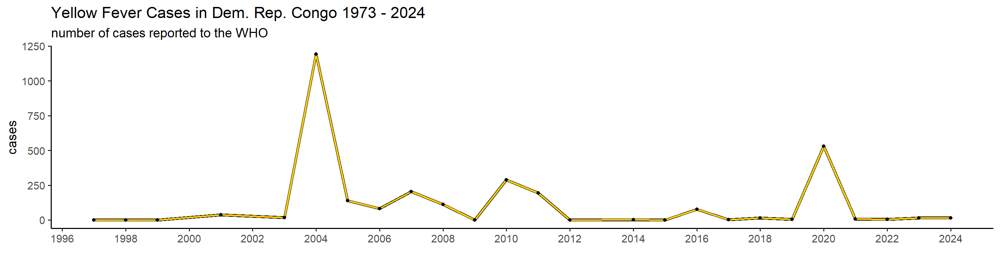
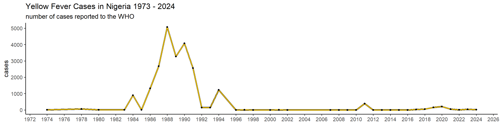
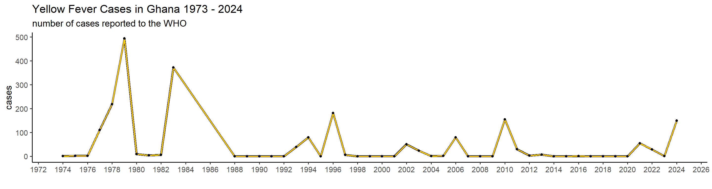
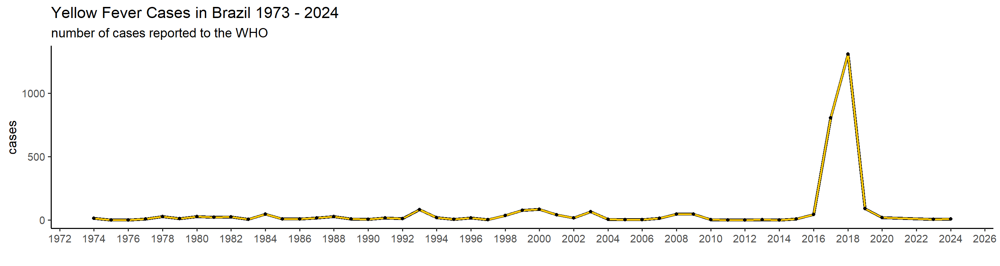
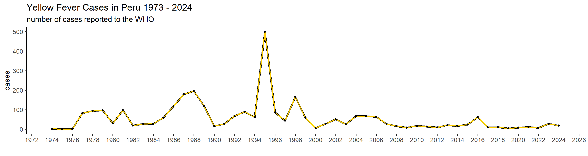

# Working with epidemiological data

Data is at the heart of epidemiology. We look at where and when diseases occur, to hopefully better understand their origin or their cause, how to prevent or cure the disease, or to make predictions about the future. That's why epidemiologists need to be able to work with disease data, and know how and where to look for it! That's why in this chapter we go over some data-extraction, processing, visualization and analysis. We start simple, with an example of Yellow Fever, and then get into more complex case in which we try to understand cholera outbreaks.

## Acessing data

- raw data
- cleaned data
- harmonization -> standardization

data cleaning: fixing or removing incorrect, incosistent or missing data
data harmonziation: standardization or alignment of data
## (Imperfect) epidemiological data

## Case Study 1: Yellow Fever

Yellow fever (YF) is a severe and sometimes fatal hemorrhagic fever caused by a flavivirus with a single-stranded, negatively oriented RNA genome. It primarily affects regions in Africa and Latin America, where the virus sustains itself through a sylvatic cycle involving wild mosquitoes and non-human primates. In Brazil, for instance, mosquito species like Haemagogus and Sabethes maintain this cycle in forested areas. While a highly effective vaccine exists, yellow fever outbreaks still occur, particularly when the virus spills over into urban settings [@Chippaux2018].

Historically, yellow fever was confined to Africa until the transatlantic slave trade introduced it to Latin America, where favorable climates and mosquito vectors allowed it to take root. Cities like New Orleans suffered repeated, devastating outbreaks in the past. Brazil saw a decline in cases mid-20th century, but a resurgence occurred between 2016 and 2018, with over 2,000 reported cases and a strikingly high death toll of 681. This resurgence was partly driven by the spread of the virus into urban areas, facilitated by Aedes aegypti and Aedes albopictus, mosquitoes that thrive in cities. Curiously, yellow fever has never established itself in Asia despite the presence of competent vectors and similar arboviruses, a mystery that may relate to immunological cross-reactivity with other flaviviruses like dengue [@Chippaux2018].

The WHO has data data available for download for many different things, including casenumbers for many infectious diseases, including that for YF. The raw data for YF you can find [here](https://www.who.int/data/gho/data/indicators/indicator-details/GHO/yellow-fever-number-of-reported-cases). I have cleaned this data a little so that the dataframe is as concise as possible, and so that all the countrynames correctly map to the ones in the **world_shapefile** dataset.

#### Installing packages

```r
library(scales)
library(ggplot2)
library(readr)
```

```
## 
## Attaching package: 'readr'
```

```
## The following object is masked from 'package:scales':
## 
##     col_factor
```

```r
library(glue)

# The following packages print a lot of noise when installing so I silence their output
# by wrapping them in a `suppressPackageStartupMessages({})
suppressPackageStartupMessages({
  library(tidyverse)
  library(gapminder)
  library(rnaturalearth)
  library(rnaturalearthdata)
  library(sf)
})
```

#### Installing world shapedata
Eventually, I want to show you how to make some plots and some maps. For that, we need to load the shape of the world, so that we can fill in countries with certain colors and such. For that we'll load the **world shapefile** from the package *rnaturalearth*. This dataset includes many different columns, but we only require some of them; name, geometry and continent.


```r
world_shapefile              = ne_countries(scale = "medium", returnclass = "sf") %>% select(c("name","geometry", "continent"))
colnames(world_shapefile)[1] = c("country")
continents_list              = unique(world_shapefile$continent)

countries_continents <- world_shapefile %>%
  st_set_geometry(NULL) %>%
  select(country, continent)

# World map

ggplot(world_shapefile) +
    geom_sf(aes(fill = continent), color = "black", linewidth = 0.01) +
    theme_minimal(base_size = 14) +
    labs(
      title = 'world shapefile',
    ) +
    theme(
      panel.background = element_rect(fill = "#f7f9fc"),
      legend.position = "right",
      plot.title = element_text(face = "bold", size = 16),
      plot.subtitle = element_text(size = 12)
    )
```


#### Yellow Fever data

```r
who_yellowfever = read_csv("data/cleaned_yellowfever.csv", show_col_types = FALSE)

# head allows us to preview the table
head(who_yellowfever)
```

```
## # A tibble: 6 × 3
##   country            year cases
##   <chr>             <dbl> <dbl>
## 1 Algeria            2024     0
## 2 Andorra            2024     0
## 3 Anguilla           2024     0
## 4 Antigua and Barb.  2024     0
## 5 Armenia            2024     0
## 6 Aruba              2024     0
```

```r
# draw up some specifications of the dataset
n_countries = length(unique(who_yellowfever$country))
first_year  = min(who_yellowfever$year)
last_year   = max(who_yellowfever$year)

glue("\nThe dataframe contains yearly casedata for {n_countries} countries between {first_year} and {last_year}")
```

```
## The dataframe contains yearly casedata for 212 countries between 1974 and 2024
```

#### Global yearly cases
Let's first get a global overview of YF in the world the past 50 years. To start with, we will create a graph showing the number of cases in the world per year, and then we'll show it per continent to see which are the ones most affected.

```r
# Global epicurve
global_yearly_casenumbers <- who_yellowfever %>%
  group_by(year) %>%
  summarise(cases = sum(cases))


ggplot(global_yearly_casenumbers) + 
  geom_line(aes(x = year, y = cases), color = 'black', linewidth = 1.5) +  # black outline
  geom_line(aes(x = year, y = cases), color = '#ffcc00', linewidth = 1) +  # yellow line
  scale_x_continuous(breaks = pretty_breaks(n = 20)) +                # I don't want a break per year. I do a max of 20 year
  theme_classic(base_size = 14)  + 
  labs(
    x = "",
    title = "Yellow Fever Cases in the world 1974 - 2024",
    subtitle = "number of cases reported to the WHO"
  )
```


#### Yearly cases per continent

```r
yearly_casenumbers_continent = merge(who_yellowfever, countries_continents, by = "country") %>% 
  group_by(year, continent) %>% 
  summarise(cases = sum(cases), .groups = "drop") %>% 
  filter(continent %in% continents_list)

ggplot(yearly_casenumbers_continent) + 
  geom_line(aes(x = year, y = cases, color = continent), linewidth = 1.5) + 
  scale_x_continuous(breaks = pretty_breaks(n = 20)) +
  theme_classic(base_size = 14) + 
  scale_color_brewer(palette = "Dark2") +  # 7 distinct colors
  labs(
    x = "",
    title = "Yellow Fever Cases in the world 1973 - 2024 per continent",
    subtitle = "number of cases reported to the WHO"
  ) +
  theme(legend.position = "bottom")
```


We can clearly tell that since 1974, Africa has experienced the largest burden by YF, though South America suffered between 2016 and 2019 as well. Let's have a look at the total sum of cases per country in the past, to see which countries and which areas are affected the most.

#### Historical burden

```r
cases_per_country = who_yellowfever%>% 
  group_by(country) %>%
  summarise(cases = sum(cases))

mapdata = st_as_sf(merge(cases_per_country, world_shapefile, on = 'country', all.y = TRUE))


mapdata$cases_category <- cut(
  mapdata$cases,
  breaks = c(0,100, 500, 1000, 2000, 5000, 10000, 20000, Inf),  # 8 breaks → 7 intervals
  labels = c("0 - 100", "101-500","501-1000",     "1001-2000",   "2001-5000",    "5001-10000",  "10001-20000",  ">20000"),
  include.lowest = TRUE
)


pl <- ggplot(mapdata) +
  geom_sf(aes(fill = cases_category), color = "black", size = 0.1) +
  scale_fill_brewer(palette = "YlOrRd", na.value = "gray95", name = "Cases") +
  theme_minimal(base_size = 14) +
    theme(
      panel.background = element_rect(fill = "#E0FFFF"),  # clean light background
      legend.position = "right",
      plot.title = element_text(face = "bold", size = 16),
      plot.subtitle = element_text(size = 12)
    ) + 
  labs(title = 'Cumulative cases 1974 - 2024')

pl
```


From this we can clearly see that the most affected regions are central and west Africa, as well as central(?) Latin America. This does not allow us to look into temporal dynamics though, so let's look a bit further into that using a function.

#### Country-specific epicurves

```r
plot_country = function(country_filter){
  
  filtered_df <- who_yellowfever %>% filter(country == country_filter)

  pl = ggplot(filtered_df) + 
    geom_line(aes(x = year, y = cases), color = 'black', linewidth = 1.5) +  # black outline
    geom_line(aes(x = year, y = cases), color = '#ffcc00', linewidth = 1) +  # yellow line
    geom_point(aes(x = year, y = cases), color = 'black', linewidth = 1) +  # black outline
    scale_x_continuous(breaks = pretty_breaks(n = 20)) +
      theme_classic(base_size = 14)  + 
    labs(x = "", y='cases') +
      labs(
      title = paste0("Yellow Fever Cases in ", country_filter,  " 1973 - 2024"),
      subtitle = "number of cases reported to the WHO"
    )
  
  return(pl)
  
}
```


```r
plot_country("Dem. Rep. Congo")
```

```
## Warning in geom_point(aes(x = year, y = cases), color = "black", linewidth =
## 1): Ignoring unknown parameters: `linewidth`
```



```r
plot_country("Chad")
```

```
## Warning in geom_point(aes(x = year, y = cases), color = "black", linewidth =
## 1): Ignoring unknown parameters: `linewidth`
```


```r
plot_country("Nigeria")
```

```
## Warning in geom_point(aes(x = year, y = cases), color = "black", linewidth =
## 1): Ignoring unknown parameters: `linewidth`
```



```r
plot_country("Ghana")
```

```
## Warning in geom_point(aes(x = year, y = cases), color = "black", linewidth =
## 1): Ignoring unknown parameters: `linewidth`
```



```r
plot_country("Brazil")
```

```
## Warning in geom_point(aes(x = year, y = cases), color = "black", linewidth =
## 1): Ignoring unknown parameters: `linewidth`
```



```r
plot_country("Peru")
```

```
## Warning in geom_point(aes(x = year, y = cases), color = "black", linewidth =
## 1): Ignoring unknown parameters: `linewidth`
```


This is actually already interesting! We can see that some many of these countries have very big outbreaks in a specific year, or over a couple of years, while a peak in one country doesn't necessarily translate in one elsewhere. Peru, for example, had a big outbreak in 1995, and hasn't had many cases since. Brazil, however, did not report manby cases until 2017 when it detected a huge outbreak that lasted until 2018.
