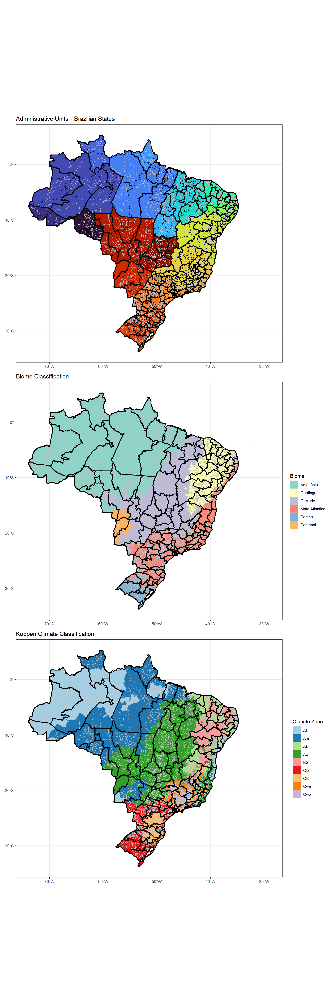

# Case Study: Dengue Fever in Brazil

## Introduction

Dengue is a mosquito-borne viral disease that affects millions of people worldwide every year. It is primarily transmitted by the *Aedes aegypti* mosquito, which thrives in tropical and subtropical climates. Globally, dengue is a growing public health concern: the World Health Organization estimates that nearly half of the world's population is at risk, and this number keeps increasing. Outbreaks are known to occur in over 100 countries. The disease ranges from mild flu-like symptoms to severe forms, including dengue hemorrhagic fever, which can be life-threatening.

Brazil represents a particularly important context for studying dengue. Its vast territory spans multiple climatic zones, from tropical rainforests to semi-arid regions, and contains a diverse range of biomes. Seasonal rainfall patterns, temperature variations, and population density all contribute to the dynamics of dengue transmission across municipalities. Additionally, large-scale climate phenomena such as El Niño and La Niña can influence local weather conditions, indirectly affecting mosquito populations and disease incidence.

In this case study, you will explore a rich dataset containing weekly dengue case counts, climate variables, population data, and ecological information for municipalities across Brazil. Using this data, we will investigate patterns of disease incidence, examine the relationship between environmental factors and dengue transmission, and apply statistical and modeling tools to draw insights.

**Learning objectives:**

- Analyze temporal and spatial patterns of dengue incidence across different ecological zones
- Explore the relationship between environmental factors and disease transmission
- Apply data visualization techniques to identify epidemiological patterns
- Integrate multiple data sources for comprehensive epidemiological analysis

## Data Sources and Structure

This analysis uses data from the Mosqlimate project (https://sprint.mosqlimate.org/data/), which provides comprehensive surveillance data for vector-borne diseases in Brazil. Our dataset includes:

- **Case data**: Weekly dengue case counts by municipality (2010-2025)
- **Population data**: Annual population estimates for incidence calculations
- **Climate data**: Temperature, precipitation, and humidity measurements
- **Environmental data**: Biome classifications and Köppen climate zones
- **Ocean climate data**: Large-scale climate oscillation indices (El Niño, La Niña)
- **Geographic data**: Shapefiles for mapping and spatial analysis

## Data Import and Preparation


```r
library(tidyverse)
library(sf)
library(lubridate)

# Set data path
compressed_data_path <- "data/dengue_compressed/"

# Import datasets
population_data <- read.csv(paste0(compressed_data_path, "datasus_population_2001_2024.csv.gz"))
case_data <- read.csv(paste0(compressed_data_path, "dengue.csv.gz"))
climate_data <- read.csv(paste0(compressed_data_path, "climate.csv.gz"))
environment_data <- read.csv(paste0(compressed_data_path, "environ_vars.csv.gz"))
ocean_data <- read.csv(paste0(compressed_data_path, "ocean_climate_oscillations.csv.gz"))

# Remove unnecessary columns from case data
cols_to_remove <- c('train_1', 'target_1', 'train_2', 'target_2', 'train_3', 'target_3', 'epiweek')
case_data <- case_data %>% select(-all_of(cols_to_remove))
```

### Data Type Standardization

To ensure consistent analysis, we'll standardize column types across all datasets:


```r
change_columntypes <- function(dataframe) {
  # Convert date column to Date object if present
  if ('date' %in% colnames(dataframe)) {
    dataframe <- dataframe %>% mutate(date = as.Date(date))
  }
  
  # Convert geographic and categorical variables to factors
  factor_columns <- c('geocode', 'uf', 'macroregional_geocode', 'regional_geocode',
                     'uf_code', 'koppen', 'biome')
  
  for (column in factor_columns) {
    if (column %in% colnames(dataframe)) {
      dataframe <- dataframe %>% 
        mutate(!!column := as.factor(.data[[column]]))
    }
  }
  
  return(dataframe)
}

# Apply standardization to all datasets
population_data <- change_columntypes(population_data)
case_data <- change_columntypes(case_data)
climate_data <- change_columntypes(climate_data)
environment_data <- change_columntypes(environment_data)
ocean_data <- change_columntypes(ocean_data)
```

### Geographic Data Import


```r
# Import shapefiles for mapping
shapefile_municipalities <- st_read(paste0(compressed_data_path, 'shape_muni.gpkg'))
shapefile_regions <- st_read(paste0(compressed_data_path, 'shape_regional_health.gpkg'))
shapefile_macroregions <- st_read(paste0(compressed_data_path, 'shape_macroregional_health.gpkg'))

# Ensure consistent data types for geographic identifiers
shapefile_municipalities$geocode <- as.factor(shapefile_municipalities$geocode)
shapefile_municipalities$uf_code <- as.factor(shapefile_municipalities$uf_code)
```

## Temporal Analysis: National Dengue Trends

Let's begin by examining the overall temporal patterns of dengue incidence in Brazil:


```r
# Calculate national case totals by week
national_cases <- case_data %>% 
  group_by(date) %>% 
  summarise(cases = sum(casos), .groups = 'drop')

# Visualize national trends
ggplot(national_cases, aes(x = date, y = cases)) +
  geom_line(color = "black", linewidth = 0.75) +
  scale_x_date(date_breaks = "1 year", date_labels = "%Y") +
  labs(x = "Year", 
       y = "Weekly Cases", 
       title = "Dengue Cases in Brazil - National Trends",
       subtitle = "Weekly reported cases 2010-2025") +
  theme_bw() +
  theme(axis.text.x = element_text(angle = 45, hjust = 1))
```


You'll note that while Dengue has been a consistent burden over the past two decades in Brazil, interestingly with the exceptions of 2017 and 2018, there was an unprecedented peak of cases in 2024. What is fascinating is that no one really knows why that was...


## Spatial Analysis: Environmental Context

Brazil's diverse geography creates distinct ecological zones that influence dengue transmission. Let's visualize the environmental context:


```r
library(patchwork)
library(RColorBrewer)

# Join environmental data with geographic boundaries
map_environment_data <- shapefile_municipalities %>%
  left_join(environment_data, by = c("geocode", "uf_code"))

# Plot 1: Brazilian states
p1 <- ggplot() +
  geom_sf(data = map_environment_data, aes(fill = uf_code), 
          color = 'grey', linewidth = 0.05) +
  geom_sf(data = shapefile_regions, fill = NA, color = "black", 
          linewidth = 0.5, linetype = 'dashed') +
  geom_sf(data = shapefile_macroregions, fill = NA, color = "black", 
          linewidth = 1) +
  scale_fill_viridis_d(option = "turbo") +
  theme_bw() +
  labs(title = "Administrative Units - Brazilian States", fill = 'State Code') +
  theme(legend.position = "none")  # Too many states for readable legend

# Plot 2: Biome classification
p2 <- ggplot() +
  geom_sf(data = map_environment_data, aes(fill = biome), 
          color = "grey", linewidth = 0.05) +
  geom_sf(data = shapefile_macroregions, fill = NA, color = "black", 
          linewidth = 1) +
  scale_fill_brewer(palette = 'Set3') +
  theme_bw() + 
  labs(title = "Biome Classification", fill = "Biome")

# Plot 3: Köppen climate zones
p3 <- ggplot() +
  geom_sf(data = map_environment_data, aes(fill = koppen), 
          color = "grey", linewidth = 0.05) +
  geom_sf(data = shapefile_macroregions, fill = NA, color = "black", 
          linewidth = 1) +
  scale_fill_brewer(palette = 'Paired') +
  theme_bw() + 
  labs(title = "Köppen Climate Classification", fill = "Climate Zone")

# Combine plots
combined_plot <- p1 / p2 / p3
combined_plot
```



## Temporal-Spatial Analysis: Annual Incidence Maps

To understand how dengue incidence varies across space and time, we'll create annual incidence maps:


```r
# Calculate yearly incidence rates
yearly_case_data <- case_data %>% 
  mutate(year = year(date)) %>%
  group_by(year, geocode) %>%
  summarise(cases = sum(casos), .groups = 'drop')

yearly_incidence <- yearly_case_data %>% 
  left_join(population_data, by = c('year', 'geocode')) %>%
  mutate(incidence = cases / population * 10000,
         geocode = as.factor(geocode))

# Join with geographic data for mapping
map_incidence_data <- shapefile_municipalities %>%
  left_join(yearly_incidence, by = "geocode")

# Create annual incidence maps
ggplot(map_incidence_data, aes(fill = incidence)) +
  geom_sf(color = NA) +
  theme_bw() +
  facet_wrap(~ year, ncol = 4) +
  scale_fill_viridis_c(option = "magma", trans = "sqrt", na.value = "grey80") +
  theme(
    legend.title = element_text(size = 16),
    legend.text = element_text(size = 14),
    legend.key.width = unit(1, "cm"),
    legend.key.height = unit(8, "cm"),
    axis.text = element_blank(),
    axis.ticks = element_blank()
  ) + 
  labs(title = 'Annual Dengue Incidence per Municipality in Brazil', 
       subtitle = '2010-2024 (incidence per 10,000 population, square root scale)',
       fill = "Incidence\n(per 10,000)")
```


What you'll see here is that throughout the years, different regions were affected. The situation in 2024 was one in which many different municipalities suffered extremely in comparison to previous years, though there's definitely a cluster in the south east of Brazil.

## Climate Oscillations: Large-Scale Environmental Drivers

Large-scale climate phenomena like El Niño and La Niña can influence regional weather patterns and dengue transmission, which has been established in some literature. Each ocean has its own index (a single value) reflecting the state its climate is in. Lets look at how that varied over time.


```r
# Prepare ocean climate data for visualization
ocean_data_long <- ocean_data %>% 
  pivot_longer(cols = -date, names_to = 'ocean_variable', values_to = 'value') %>%
  mutate(date = as.Date(date),
         ocean_variable = as.factor(ocean_variable))

# Plot climate oscillation indices
ggplot(ocean_data_long, aes(x = date, y = value, color = ocean_variable)) +
  geom_line(linewidth = 1) +
  facet_wrap(~ocean_variable, nrow = 3, scales = "free_y") +
  theme_bw() +
  labs(title = "Ocean Climate Oscillation Indices",
       subtitle = "Large-scale climate patterns affecting regional weather",
       x = "Date",
       y = "Index Value") +
  theme(legend.position = "none")
```


## Ecological Analysis: Incidence by Environmental Zones

Now let's examine how dengue incidence varies across different biomes and climate zones. Note that the big outbreak observed in 2024 was not seen for every biome in Brazil.


```r
# Prepare data with environmental classifications
cases_environment_data <- case_data %>%
  mutate(year = year(date)) %>%
  filter(year < 2025) %>%
  left_join(population_data, by = c('year', 'geocode')) %>%
  left_join(environment_data, by = 'geocode')

# Calculate incidence rates by biome
incidence_rates_by_biome <- cases_environment_data %>%
  group_by(date, year, biome) %>%
  summarise(incidence = sum(casos, na.rm = TRUE) / sum(population, na.rm = TRUE) * 10000,
            .groups = 'drop')

# Calculate incidence rates by Köppen climate zone
incidence_rates_by_koppen <- cases_environment_data %>%
  group_by(date, koppen) %>%
  summarise(incidence = sum(casos, na.rm = TRUE) / sum(population, na.rm = TRUE) * 10000,
            .groups = 'drop')

# Plot incidence trends by biome
p_biome <- ggplot(incidence_rates_by_biome) +
  geom_line(aes(x = date, y = incidence, group = biome), 
            color = 'black', linewidth = 1.5) +
  geom_line(aes(x = date, y = incidence, group = biome, color = biome), 
            linewidth = 1) +
  scale_color_brewer(palette = 'Set3') +
  facet_wrap(~biome, nrow = 3) + 
  theme_bw() +
  labs(title = "Dengue Incidence by Biome",
       x = "Date",
       y = "Incidence per 10,000") +
  theme(legend.position = "none")

# Plot incidence trends by Köppen climate zone
p_koppen <- ggplot(incidence_rates_by_koppen) +
  geom_line(aes(x = date, y = incidence, group = koppen), 
            color = 'black', linewidth = 1.5) +
  geom_line(aes(x = date, y = incidence, group = koppen, color = koppen), 
            linewidth = 1) +
  scale_color_brewer(palette = 'Paired') +
  facet_wrap(~koppen, nrow = 3) + 
  theme_bw() +
  labs(title = "Dengue Incidence by Köppen Climate Zone",
       x = "Date",
       y = "Incidence per 10,000") +
  theme(legend.position = "none")

p_biome
```


```r
p_koppen
```


## Seasonal Analysis: Weekly Patterns by Biome

Dengue transmission is highly seasonal, influenced by rainfall, temperature, and mosquito breeding cycles. Let's examine the seasonal patterns across different biomes:


```r
# Prepare seasonal analysis (excluding incomplete 2025 data)
seasonal_data <- incidence_rates_by_biome %>%
  filter(year != 2025) %>%
  mutate(week = week(date))

# Calculate average weekly incidence by biome
seasonal_incidence_by_biome <- seasonal_data %>%
  group_by(biome, week) %>%
  summarise(mean_incidence = mean(incidence, na.rm = TRUE), 
            .groups = 'drop')

# Plot seasonal patterns
ggplot(seasonal_incidence_by_biome, aes(x = week, y = mean_incidence, color = biome)) +
  geom_line(size = 1.2) +
  labs(title = "Seasonal Dengue Patterns by Biome",
       subtitle = "Average weekly incidence across all years (2010-2024)",
       x = "Week of Year",
       y = "Mean Incidence per 10,000 Population",
       color = "Biome") +
  scale_color_brewer(palette = "Dark2") +
  theme_minimal() +
  scale_x_continuous(limits = c(1, 53), 
                     breaks = seq(1, 53, by = 4),
                     labels = seq(1, 53, by = 4)) +
  theme(legend.position = "bottom")
```

```
## Warning: Using `size` aesthetic for lines was deprecated in ggplot2 3.4.0.
## ℹ Please use `linewidth` instead.
## This warning is displayed once every 8 hours.
## Call `lifecycle::last_lifecycle_warnings()` to see where this warning was
## generated.
```


Now this is an interesting one. Here you see the total number of incidence rates per calendar week between 2010 and 2024 per biome. The absolute number is not really important, which I assume heavily depends on how populated these areas are. What is interesting though, is that in the final few weeks of the year, cases rise in the *cerrado*, *pantanal* and *mata atlantica*, while cases in *caatinga* and *pampa* rise much later (week 5 and 9 respectively). We can probably have a look whether there are any climate variables that rise and fall around the same periods in the same areas, and whether this pattern is observed over multiple years or is just an artefact of the aggregation of all years combined.


## Discussion and Key Findings

This comprehensive analysis of dengue patterns in Brazil reveals several important epidemiological insights:

**Temporal Patterns:**
- Clear epidemic cycles with major outbreaks occurring every few years
- Strong seasonal patterns with peak transmission during warmer, wetter months
- Variation in seasonal timing across different biomes and climate zones

**Spatial Patterns:**
- Heterogeneous distribution across Brazil's diverse geography
- Higher incidence rates in tropical and subtropical regions
- Urban and peri-urban areas showing different transmission dynamics

**Environmental Associations:**
- Different biomes exhibit distinct seasonal patterns and incidence levels
- Climate zones show varying susceptibility to dengue transmission
- Large-scale climate oscillations may influence epidemic timing and intensity

This analysis demonstrates the complexity of dengue epidemiology and the importance of considering environmental, temporal, and spatial factors in understanding disease transmission patterns. Such insights are crucial for developing targeted prevention strategies and early warning systems for dengue control in Brazil.

## Further Analysis Opportunities

This dataset provides numerous opportunities for additional epidemiological investigations:
- Statistical modeling of climate-disease associations
- Time series analysis and forecasting
- Spatial clustering analysis
- Risk factor identification and quantification
- Evaluation of control interventions
